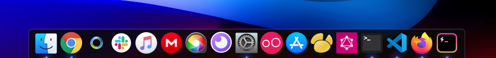
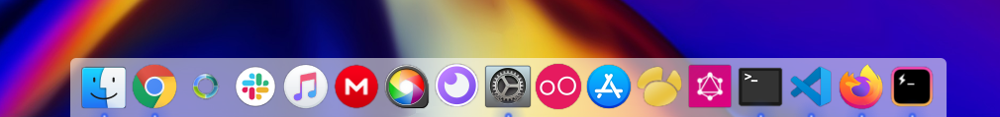
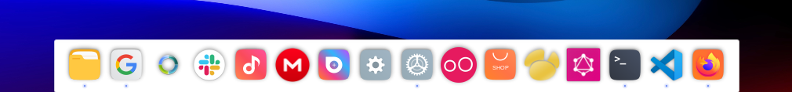

# Plank Themes like macOS

Current themes:

- macOS Dark
- macOS Light
- macOS Night Owl
- Material Design

Frequently I will be bringing new themes.

## Installation steps:

1.  `Clone or download.`
[Dowload Link](https://github.com/x64Bits/plank-themes/releases/download/v0.1.0/plank-themes-master.zip "Download Link")

2.  `unzip all folders.`

3.  `Copy and Paste all folders or what you like theme on you theme folder depending on your distro, Usually in debian-based distributions, the Plank theme folder is usually located at: "~/.local/share/plank/themes".`

4.  `Open plank preferences with: Ctrl+Right click under the dock -> Preferences`
5.  `Theme -> macOS Dark/Light/Night Owl`

## Preview

### macOS Dark

Icons theme used on the preview:
Mojave CT https://github.com/zayronxio/Mojave-CT

### macOS Light

### macOS Night Owl

Based on Sarah Drasner theme for VSCode.

### Material

Based on Material Design by Google

Icons theme used on the preview:
Reversal icon theme https://github.com/yeyushengfan258/Reversal-icon-theme

